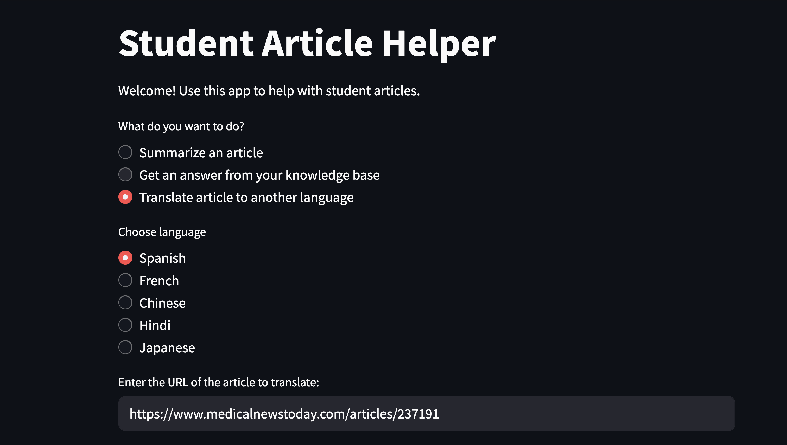

A lightweight Streamlit app for document understanding: summarization, Q&A, translation, and text rewriting

## Why it exists?
Manually extracting insights from web articles can be time-consuming and tedious.
This app leverages OpenAI’s LLMs and LangChain to let users:
- Summarize web articles
- Ask questions about content
- Translate articles 
- Rewrite articles based on tone, reading level, or age group preference
All in a single, easy-to-use Streamlit UI—just input a web article URL.

## Demo
### Summarization Feature

### Translation Feature

### Text Rewriting Feature
Original text:
"Healthy eating is not about imposing strict dietary restrictions, striving for an unrealistic body weight, or depriving oneself of favorite foods. Instead, it involves consuming balanced meals that enhance well-being, increase energy levels, improve health, and elevate mood"

**Kid-friendly rewrite:**
"Eating healthy doesn’t mean you have to stop eating your favorite foods or try to be super skinny. It means eating different kinds of foods that help you feel good, have energy, stay healthy, and be happy."

Original text:
"Try to eat a variety of fresh foods and reduce packaged foods whenever possible."

**Professional rewrite:**
“Aim to reduce the consumption of packaged and heavily processed foods, opting instead for fresh ingredients whenever feasible.”

## Features
-Summarization using MapReduce
-Translation to multiple languages
-FAISS vectorstore for Q&A
-Text rewriting for different audiences, tones, and purposes

## Future Directions
- Multi-format support (PDFs, Word, images)
- Smarter chunking: semantic splitting
- Flexible output (bullet points, detailed summaries)
- Sentiment analysis
- Dashboard to manage multiple documents
- Search and filter in knowledge base
- Compare original and translated articles for accuracy

## Tech Stack
Frontend: Streamlit
LLM Management: LangChain
LLM: OpenAI GPT-4o
Vector Store: FAISS
Programming Language: Python