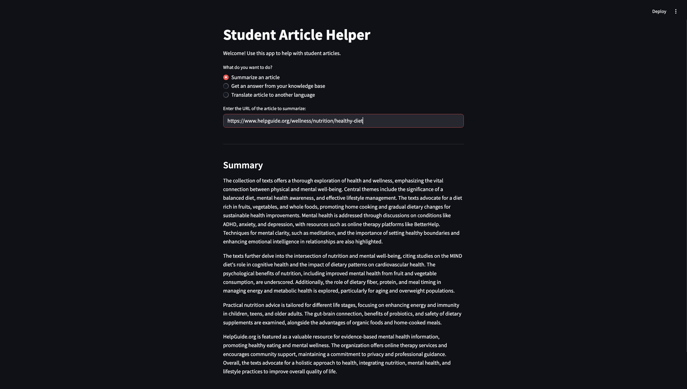

Document Helper is a lightweight Streamlit app for document understanding, providing summarization, Q&A, and translation.

Why it exists?
Manually extracting insights from web articles can be time-consuming and tedious.
This project leverages OpenAI’s LLMs along with LangChain to let users:

Summarize web articles
Ask questions about the content
Translate articles into different languages (coming soon)
All in a single easy-to-use Streamlit UI—simply input a web article URL to get started.

## Demo
**Summarization Feature**

**Translation Feature**

Features

Implemented:
-Summarization of long articles using MapReduce to reduce token usage per LLM call
-Translation of text (in progress)
-Use of FAISS vectorstore to store embeddings for each chunk and answer questions using the most relevant info from the knowledge base

Future Directions:

Enhanced Document Processing
-Translate long articles to multiple languages using MapReduce
-Multi-format support: PDFs, Word docs, or scanned images
-Smarter chunking: semantic splitting based on paragraphs or headings

Advanced AI Capabilities
-Flexible output: bullet points, detailed summaries
-Sentiment analysis on documents

UX Improvements
-Upload multiple documents and manage them in a dashboard
-Search and filter in the knowledge base

Insights & Analytics
-Track which topics are summarized or queried the most
-Compare original and translated articles for accuracy

Tech Stack
Frontend: Streamlit
LLM Management: LangChain
LLM: OpenAI GPT-4o
Vector Store: FAISS
Programming Language: Python